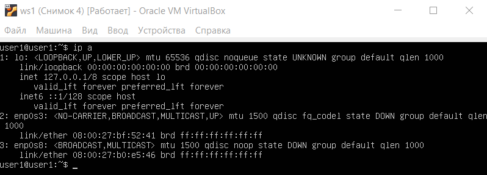
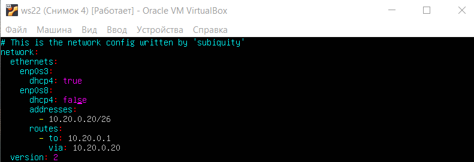
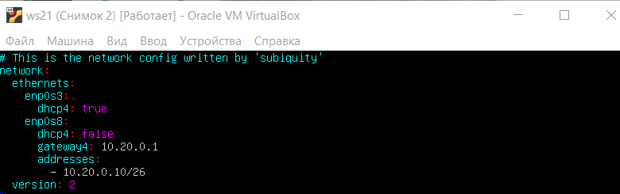
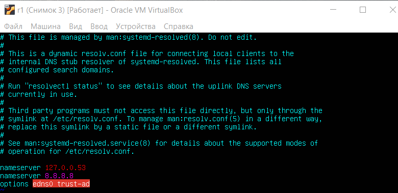

-  [Part 1. Инструмент ipcalc](#part-1-инструмент-ipcalc)
-  [Part 2. Статическая маршрутизация между двумя машинами](#part-2статическая-маршрутизация-между-двумя-машинами)
-  [Part 3. Утилита iperf3](#part-3-утилита-iperf3)
-  [Part 4. Сетевой экран](#part-4-сетевой-экран)
-  [Part 5. Статическая маршрутизация сети](#part-5-статическая-маршрутизация-сети)
-  [Part 6. Динамическая настройка IP с помощью DHCP](#part-6-динамическая-настройка-ip-с-помощью-dhcp)
-  [Part 7. NAT](#part-7-nat)
-  [Part 8. Дополнительно. SSH Tunnels](#part-8-дополнительно-ssh-tunnels)

## Part 1. Инструмент ipcalc
1.1. Сети и маски.

1.1.1. Адрес сети 192.167.38.54/13: 11000000.10100 111.00100110.00110110

>Рисунок 1.1. Адрес сети 192.167.38.54/13

1.1.2 Перевод масок.
- Перевод маски 255.255.255.0 в:
  + Двоичную запись: 11111111.11111111.11111111. 00000000.
  + Префиксную запись: /24

- Перевод маски "/15" в:
  + Обычную запись: 255.254.0.0.
  + Двоичную запись: 11111111.11111110.00000000. 00000000.
 
- Перевод маски 11111111.11111111.11111111.11110000 в:
  + Обычную запись: 255.255.255.240.
  + Префиксную запись: /28.

1.1.3. Минимальный и максимальный хост сети 12.167.38.4.
- При маске /8:
  + минимальный: 12.0.0.1.
  + максимальный: 12.255.255.254.
- При маске 11111111.11111111.00000000.00000000:
  + минимальный: 12.167.0.1.
  + максимальный: 12.167.255.254.
- При маске 255.255.254.0:
  + минимальный: 12.167.38.1.
  + максимальный: 12.167.39.254.
- При маске /4:
  + минимальный: 0.0.0.1.
  + максимальный: 15.255.255.254.

> Рисунок 1.2. Хост при маске /8.

> Рисунок 1.3. Хост при маске /16.

> Рисунок 1.4. Хост при маске /23.

>  Рисунок 1.5.Хост при маске /4.

1.2. localhost. Можно ли обратиться к приложению, работающему на localhost, со следующими IP: 
- 194.34.23.100: Class C, нельзя.
- 127.0.0.2: Class A, loopback - обратиться можно;
- 127.1.0.1: Class A, loopback - обратиться можно; 
- 128.0.0.1: Class B, нельзя.

1.3. Диапазоны и сегменты сетей.

1.3.1. Публичные и частные адреса.
- Private Internet:
  + 10.0.0.45.
  + 192.168.4.2.
  + 172.20.250.4.
  + 172.16.255.255.
  + 10.10.10.10.
- Публичные: 
  + 134.43.0.2.
  + 172.0.2.1.
  + 192.172.0.1.
  + 172.68.0.2.
  + 192.169.168.1.

1.3.2. IP адреса шлюза, которые возможны у сети.
- 10.10.0.0/18:
  + 10.10.0.2;
  + 10.10.10.10
- Не подходят:
  + 10.10.100.1;
  + 10.10.1.255;
  + 10.0.0.1;

## Part 2.Статическая маршрутизация между двумя машинами

2.0. Поднять две виртуальные машины.

> Рисунок 1.6. Команда "ip a" на виртуальной машине ws1.

> Рисунок 1.7. Команда "ip a" на виртуальной машине ws2.

 2.0.1. Сетевой интерфейс, соответствующий внутренней сети: enp0s8

 
> Рисунок 1.8. Файл etc/netplan/00-installer-config.yaml для w1 и w2.
 

 
> Рисунок 1.9. Перезапуск сервисов сети для w1 и w2.

 
> Рисунок 2.0. Ping для w1 и w2.

 
> Рисунок 2.1. Статические настройки. Netplan для w1 и w2.

 
> Рисунок 2.2. Статические настройки. Ping для w1 и w2.

## Part 3. Утилита iperf3

3.1. Перевод единиц измерения скорости соединения:

- 8 Mbps = 1 MB/s;
- 100 MB/s в 800000 Kbps; 
- 1 Gbps в 1000 Mbps.

3.2. Утилита iperf3.

 > Рисунок 2.3. Измерение скорости соединения, с помощью утилиты iperf3. Сервер - w1.

> Рисунок 2.4. Измерение скорости соединения, с помощью утилиты iperf3. Сервер - w2.

## Part 4. Сетевой экран

- Существует три типа правил iptables:
  + input - контроль поведения входящих соединений;
  + forward - обработкa входящих сообщений, конечный пункт назначения которых не является текущим сервером;
  + output - контроль исходящих соединений.
- Действия с соединениями:
  + Accept — разрешить соединение;
  + Drop — игнорировать соединение;
  + Reject — заблокировать соединение и отправить в ответ сообщение об ошибке;

 
> Рисунок 2.5. Создание sh файлов, вызывающих iptables на машинах w1 и w2.

- Правила обрабатываются в порядке их объявления. В случае с w1:
  + Запрещаем принятие пакетов с хоста, но потом разрешаем ответ на пинг. Пинг проходит, потому что пакеты не заблокированы firewall'ом.

- В случае с w2:
  + Разрешаем принятие пакетов, но запрещаем ответ на пинг. Пакеты заблокированы firewall'ом.

 
> Рисунок 2.6. Ping w1 и w2 после того, как внесены изменения в скрипт и выполнена команда chmod +x.

- Командой ping нашли машину, которая не "пингуется", после чего утилитой nmap демонстрируем, что хост машины запущен.

 
> Рисунок 2.7. Выполнение команды nmap на машине w1.

## Part 5. Статическая маршрутизация сети

5.1. Настройка сети:

 
> Рисунок 2.8. /etc/netplan/00-installer-config.yaml для машины ws11.

 
> Рисунок 2.9. /etc/netplan/00-installer-config.yaml для машины ws22.

 
> Рисунок 3.0. /etc/netplan/00-installer-config.yaml для машины ws21.

 
> Рисунок 3.1. /etc/netplan/00-installer-config.yaml для роутера r1.

 
> Рисунок 3.2. /etc/netplan/00-installer-config.yaml для роутера r2.

 
> Рисунок 3.3. "ip -4 a" для роутеров r1 и r2.

 
> Рисунок 3.4. "ip -4 a" для машин ws11 и ws21.

 
> Рисунок 3.5. "ip -4 a" для машины ws22.

 
> Рисунок 3.6. Пингуем ws22 с машины ws21.

 
> Рисунок 3.7. Пингуем роутер r1 с машины ws11.

5.2.0. Включение переадресации IP-адресов с помощью команды (не будет работать после перезагрузки системы).

 
> Рисунок 3.8. Включение переадресации на роутерах при помощи команды.

5.2.1. Включение переадресации IP-адресов с помощью внесения изменений в файл /etc/sysctl.conf (будет работать после перезагрузки системы).

 
> Рисунок 3.9. Включение переадресации на роутерах при помощи редактирования файла файла /etc/sysctl.conf.

 5.3. Установка маршрута по-умолчанию для рабочих станций.

 
> Рисунок 4.0. Настройка шлюза для рабочей станции w11.

 
> Рисунок 4.1. ip r после настройки шлюза для рабочей станции w11.

 
> Рисунок 4.2. Настройка шлюза для рабочей станции w21.

 
> Рисунок 4.3. ip r после настройки шлюза для рабочей станции w21.

 
> Рисунок 4.4. Настройка шлюза для рабочей станции w22.

 
> Рисунок 4.5. ip r после настройки шлюза для рабочей станции w22.

 
> Рисунок 4.6. ping из рабочей станции ws11 к роутеру r2 и проверка на роутере r2, что пинг доходит командой tcpdump -tn -i eth1.

5.4. Добавление статических маршрутов

 
> Рисунок 4.7. Изменённый файл etc/netplan/00-installer-config.yaml для r1 и r2.

 
> Рисунок 4.8. ip r для r1 и r2.

 
> Рисунок 4.9. ip r list 0.0.0.0/0 и 10.10.0.0/18 для ws11.

- IP-адрес 0.0.0.0 — это немаршрутизируемый адрес IPv4, который можно использовать в разных целях, в основном, в качестве адреса по умолчанию или адреса-заполнителя. IP-адрес 0.0.0.0 означает «эта сеть».
В контексте серверов 0.0.0.0 означает «все адреса IPv4 на локальном компьютере».

5.5. Построение списка маршрутизаторов

 
> Рисунок 5.0. Вызов и вывод команды traceroute на w11.

 
> Рисунок 5.1. Вызов и вывод команды tcpdump на r1.

- Команда traceroute linux использует UDP пакеты. Она отправляет пакет с TTL=1 и смотрит адрес ответившего узла, дальше TTL=2, TTL=3 и так пока не достигнет цели. Каждый раз отправляется по три пакета и для каждого из них измеряется время прохождения. Пакет отправляется на случайный порт, который, скорее всего, не занят. Когда утилита traceroute получает сообщение от целевого узла о том, что порт недоступен трассировка считается завершенной.
- В данном случае пакеты прошли три узла: 10.10.0.1, 10.100.0.12 и конечная точка - 10.20.0.10. 
  + В начале пакет отправился со статического gateway 10.10.0.1 до 10.10.0.2 конечный узел достигнут не был и мы получили сообщение "time exceeded".
  + следующей точкой был адрес 10.100.0.12, пакеты были получены на конечном узле и утилита посылает ответ, сигнализирующий о завершении трассировки.

5.6. Использование протокола ICMP при маршрутизации

 
> Рисунок 5.2. Перехват сетевого трафика, проходящего через r1 командой "tcpdump -n -i eth0 icmp" и пинг с ws11 несуществующего IP 10.30.0.111 с помощью команды "ping -c 1 10.30.0.111".

## Part 6. Динамическая настройка IP с помощью DHCP

 
> Рисунок 5.3. Настройка в файле /etc/dhcp/dhcpd.conf конфигурации службы DHCP с указанием адреса маршрутизатора по-умолчанию, DNS-сервера и адреса внутренней сети.

 
> Рисунок 5.4. nameserver 8.8.8.8. в файле resolv.conf.

 
> Рисунок 5.5. Перезагрузка службы DHCP командой systemctl restart isc-dhcp-server.

 
> Рисунок 5.6. Команда ip a на машине w21.

 
> Рисунок 5.7. Пинг ws22 с ws21.

 
> Рисунок 5.8. MAC адрес у ws11, в etc/netplan/00-installer-config.yaml.

 
> Рисунок 5.9. MAC адрес у ws11, ip a.

 
> Рисунок 6.0. Настройка в файле /etc/dhcp/dhcpd.conf для r1 с жесткой привязкой к MAC-адресу.

 
> Рисунок 6.1. nameserver 8.8.8.8. в файле resolv.conf для r1.

 
> Рисунок 6.2. Перезагрузка службы DHCP командой systemctl restart isc-dhcp-server для r1.

 
> Рисунок 6.3. Пинг ws22 с ws11.

 
> Рисунок 6.4. Пинг ws21 с ws11.

 
> Рисунок 6.5. ip a до обновления на рабочей станции ws21.

 
> Рисунок 6.6. Команды используемые для обновления IP на рабочей станции ws21.

 
> Рисунок 6.7. ip a после обновления на рабочей станции ws21.

- Использовались следующие опции DHCP сервера:
  + Option 1 - IP subnet mask;
  + Option 3 - the default gateway;
  + Option 51 defines for how long the IP address is leased to the client;

## Part 7. NAT

 
> Рисунок 6.8. Pедактирование /etc/apache2/ports.conf на ws22.

 
> Рисунок 6.9. Pедактирование /etc/apache2/ports.conf на r1.

 
> Рисунок 7.0. Запуск веб-сервера Apache командой service apache2 start на r1 и ws22.

 
> Рисунок 7.1. Добавляем в фаервол на r2 новые правила.

 
> Рисунок 7.2. запускаем скрипт на r2.

 
> Рисунок 7.3. Пинг с r1 и обратно не проходит из-за запрета на r2.

 
> Рисунок 7.4. Разрешаем маршрутизацию всех пакетов протокола ICMP на r2.

 
> Рисунок 7.5. Пинг с r1 на ws22 и обратно после добавления правила на разрешение маршрутизации всех пакетов протокола ICMP.

 
> Рисунок 7.6. Включаем SNAT, для ip за r2 и DNAT на 8080 порт машины r2.

 
> Рисунок 7.7. Cоединение по TCP для SNAT, подключение с ws22 к серверу Apache на r1 и обратно.

 
> Рисунок 7.8. Cоединение по TCP для SNAT, с r1 подключаемся к серверу Apache на ws22 командой telnet (при этом обращаемся по адресу r2 и порту 8080).

## Part 8. Дополнительно. SSH Tunnels

 
> Рисунок 7.9. Изменение на машине w22 в файле /etc/apache2/ports.conf.

 
> Рисунок 8.0. Local TCP forwarding с ws21 до ws22, для получения доступа к веб-серверу на ws22 с ws21.

 
> Рисунок 8.1. Remote TCP forwarding с ws21 до ws22, для получения доступа к веб-серверу на ws22 с ws21.

